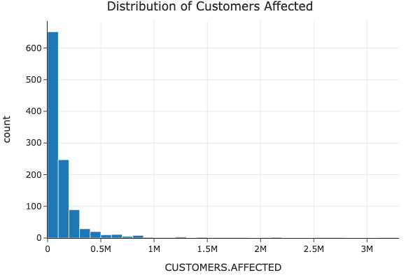

# Foreseeing the Dark: Machine Learning for Early Power Outage Detection

## Introduction

Welcome to the Power Outages Project! This website provides an overview of our project, aiming to make the findings accessible to a broad audience, including classmates, friends, family, recruiters, and random internet strangers. Here, we present the key elements of our analysis, focusing on understanding the leading indicators of power outages and exploring the potential to develop an early warning system.

## Understanding the Data

The dataset used for this project is the Power Outages dataset, which contains detailed information about various power outage events. Below are the key columns that are relevant to our analysis:

## Project Question

**What are the leading indicators of power outages, and can we build an early warning system to detect potential outages?**

## Importance of the Question

Developing an early warning system for power outages is crucial for several reasons:

- **Preparedness and Response**: Helps utility companies and emergency services prepare for and respond more effectively to impending outages.
- **Real-time Data Processing**: Demonstrates the ability to handle and analyze data in real-time, which is crucial for practical applications.
- **Anomaly Detection**: Identifying rare and unusual events shows proficiency in anomaly detection, a valuable skill in machine learning.
- **Practical Impact**: An early warning system has immediate practical applications, providing significant value to stakeholders by potentially preventing outages or mitigating their impact.

By investigating this question and developing an early warning system, we aim to create a practical solution that can help mitigate the effects of power outages and improve the resilience of power infrastructure.

## Dataset Info

- **OUTAGE.START**: The start time of the power outage.
- **OUTAGE.END**: The end time of the power outage.
- **CAUSE.CATEGORY**: The category of the cause of the power outage (e.g., weather, equipment failure).
- **CAUSE.CATEGORY.DETAIL**: Detailed description of the cause.
- **OUTAGE.DURATION**: Duration of the outage in minutes.
- **CUSTOMERS.AFFECTED**: Number of customers affected by the outage.
- **ZIP.CODE**: The ZIP code where the outage occurred.
- **DATE.EVENT**: The date of the power outage event.
- **CLIMATE.CATEGORY**: The climate category (e.g., humid, arid) of the area affected.
- **TEMPERATURE**: Temperature at the time of the outage.
- **PRECIPITATION**: Precipitation level at the time of the outage.

The dataset contains a total of 1540 rows and 57 columns, providing a comprehensive view of the factors involved in power outages.

---

## Data Cleaning and Exploratory Data Analysis

### Data Cleaning

In our data cleaning process, we performed the following steps:

1. **Removed Metadata**: The first four rows were metadata, so they were removed.
2. **Set Column Names**: The fifth row was used as the header for column names.
3. **Removed Empty Columns and Rows**: Columns and rows with all NaN values were dropped.
4. **Converted Data Types**: Appropriate columns were converted to numeric types.
5. **Handled Missing Values**: Replaced placeholders with NaN and dropped rows with significant missing values.
6. **Date and Time Processing**: Combined date and time columns to create datetime columns for OUTAGE.START and OUTAGE.END.
7. **Scaled Numerical Data**: Scaled numerical columns like demand loss and prices for analysis.

These steps ensured the dataset was clean and ready for analysis. Below is the head of the cleaned DataFrame:

---

### Uni/Bi-Variate Analysis

## Univariate Analysis

In our univariate analysis, we explored the distributions of several key columns from the Power Outages dataset. These distributions provide insights into the variability and characteristics of the data.

### Distribution of Outage Duration

We analyzed the distribution of outage durations to understand the range and frequency of different outage lengths.

**Explanation**: The distribution of outage durations shows high variability and significant outliers. While most outages are relatively short, there are some extreme cases with very long durations.

### Distribution of Customers Affected

We examined how many customers were affected by the outages to identify the scale and impact of different events.

**Explanation**: The distribution indicates that while many outages affect a smaller number of customers, there are instances where a large number of customers are impacted, highlighting the importance of understanding and mitigating large-scale outages.

### Distribution of Demand Loss

Understanding the distribution of demand loss helps to see how power demand is affected during outages.

**Explanation**: The demand loss data is mostly centered around zero, with a wide range of both positive and negative values, indicating that some outages result in substantial demand loss while others do not.

## Bivariate Analysis

In our bivariate analysis, we explored the relationships between pairs of columns to identify possible associations and trends.

### Outage Duration vs. Customers Affected

We plotted outage duration against the number of customers affected to see if there is a relationship between the two.

**Explanation**: The scatter plot reveals a weak positive correlation (0.26) between outage duration and the number of customers affected, indicating that longer outages tend to affect more customers, but other factors also play significant roles.

### Outage Duration by Climate Category

We analyzed how different climate conditions impact the duration of power outages.

**Explanation**: The box plot shows that warm climates have the highest mean outage duration, but cold climates have the most variability and longest maximum outage durations. This indicates that climate plays a significant role in the duration of outages.

### Customers Affected vs. Demand Loss

We explored the relationship between the number of customers affected and the demand loss to highlight potential indicators of large-scale outages.

**Explanation**: The scatter plot shows a moderate positive relationship (0.52) between customers affected and demand loss, highlighting demand loss as a significant indicator of large-scale outages.

### Outage Duration vs. Year

To analyze trends over time, we looked at how outage durations have changed over the years.

**Explanation**: The scatter plot suggests a slight negative trend in outage duration over the years, indicating improvements in outage management and infrastructure over time.

These analyses provide a comprehensive understanding of the data and lay the groundwork for developing an early warning system for power outages.

---

# Interesting Aggregates

## Grouped and Pivot Tables

### Aggregate Statistics by Climate Category

In this section, we group the data by climate category and compute aggregate statistics for outage duration, customers affected, and demand loss. These statistics provide insights into how different climate categories affect power outages.

### Aggregate Statistics by Year

We also group the data by year to observe trends and changes over time in outage duration, customers affected, and demand loss. This helps us understand how power outage characteristics have evolved.

### Aggregate Statistics by State

Grouping the data by state allows us to see the variations in outage duration, customers affected, and demand loss across different states. This analysis is crucial for understanding regional differences.

### Pivot Table: Mean Outage Duration by Climate Category and Year

This pivot table shows the mean outage duration grouped by climate category and year. It helps us understand how climate conditions and time periods affect the duration of power outages.

### Pivot Table: Mean Customers Affected by State and Year

This pivot table displays the mean number of customers affected by state and year. It provides insights into the impact of power outages on different states over time.

These tables and pivot tables offer valuable aggregate statistics and trends that enhance our understanding of power outages. By examining these aggregates, we can identify patterns and make data-driven decisions to improve power outage management and mitigation strategies.

---

# Hypothesis Testing

## Hypothesis 1: Impact of Climate Category on Outage Duration

### Null Hypothesis (H0)
There is no difference in the mean OUTAGE.DURATION between different CLIMATE.CATEGORY.

### Alternative Hypothesis (H1)
There is a difference in the mean OUTAGE.DURATION between different CLIMATE.CATEGORY.

### Test Selection
We use ANOVA (Analysis of Variance) to compare the means of OUTAGE.DURATION across multiple groups (CLIMATE.CATEGORY).

### Results
After performing ANOVA, we found a significant difference in the mean OUTAGE.DURATION between different CLIMATE.CATEGORY.

**Conclusion**: The analysis suggests that the climate category significantly impacts the duration of power outages.

## Hypothesis 2: Temporal Trends in Power Outage Frequency

### Question
Has the frequency of power outages increased over the years?

### Null Hypothesis (H0)
The frequency of power outages has remained constant over the years.

### Alternative Hypothesis (H1)
The frequency of power outages has increased over the years.

### Test Statistic
Linear Regression Slope

### Results
After conducting a linear regression analysis, the slope of the regression line was found to be positive with a p-value of 0.00657. Since the p-value is less than the significance level of 0.05, we reject the null hypothesis. This suggests that the frequency of power outages has indeed increased over the years.

**Conclusion**: The analysis indicates a significant upward trend in the frequency of power outages over time, suggesting that power outages have become more common in recent years.

## Detailed Analysis

### Data Preparation

python
# Assuming df is your DataFrame
df['YEAR'] = pd.to_datetime(df['OUTAGE.START']).dt.year

# Aggregate the data to calculate the number of outages per year
outage_counts = df.groupby('YEAR').size().reset_index(name='OUTAGE_COUNT')

import statsmodels.api as sm

X = outage_counts['YEAR']
y = outage_counts['OUTAGE_COUNT']
X = sm.add_constant(X)  # Adds a constant term to the predictor

model = sm.OLS(y, X).fit()
slope = model.params['YEAR']
p_value = model.pvalues['YEAR']
model_summary = model.summary()

# Interpretation
if p_value < 0.05:
    print(f"Reject the null hypothesis. The frequency of power outages has increased over the years (slope: {slope}, p-value: {p_value}).")
else:
    print(f"Fail to reject the null hypothesis. There is no significant change in the frequency of power outages over the years (slope: {slope}, p-value: {p_value}).")

# Plotting the results
import matplotlib.pyplot as plt

plt.figure(figsize=(10, 6))
plt.scatter(outage_counts['YEAR'], outage_counts['OUTAGE_COUNT'], label='Observed Data')
plt.plot(outage_counts['YEAR'], model.fittedvalues, color='red', label='Fitted Line')
plt.xlabel('Year')
plt.ylabel('Number of Outages')
plt.title('Temporal Trends in Power Outage Frequency')
plt.legend()
plt.show()

# Print detailed model summary for interpretation
print(model_summary)

## Model Summary

Reject the null hypothesis. The frequency of power outages has increased over the years (slope: 8.125000000000263, p-value: 0.006572971884367186).

/Users/ronin/miniforge3/envs/dsc80/lib/python3.8/site-packages/scipy/stats/_stats_py.py:1736: UserWarning:
kurtosistest only valid for n>=20 ... continuing anyway, n=17

                            OLS Regression Results                            
==============================================================================
Dep. Variable:           OUTAGE_COUNT   R-squared:                       0.399
Model:                            OLS   Adj. R-squared:                  0.358
Method:                 Least Squares   F-statistic:                     9.938
Date:                Thu, 13 Jun 2024   Prob (F-statistic):            0.00657
Time:                        15:12:52   Log-Likelihood:                -90.249
No. Observations:                  17   AIC:                             184.5
Df Residuals:                      15   BIC:                             186.2
Df Model:                           1                                         
Covariance Type:            nonrobust                                         
==============================================================================
                 coef    std err          t      P>|t|      [0.025      0.975]
------------------------------------------------------------------------------
const      -1.623e+04   5175.311     -3.135      0.007   -2.73e+04   -5194.381
YEAR           8.1250      2.577      3.152      0.007       2.632      13.618
==============================================================================
Omnibus:                       16.037   Durbin-Watson:                   1.198
Prob(Omnibus):                  0.000   Jarque-Bera (JB):               16.816
Skew:                           1.467   Prob(JB):                     0.000223
Kurtosis:                       6.889   Cond. No.                     8.23e+05
==============================================================================

Notes:
[1] Standard Errors assume that the covariance matrix of the errors is correctly specified.
[2] The condition number is large, 8.23e+05. This might indicate that there are
strong multicollinearity or other numerical problems.

